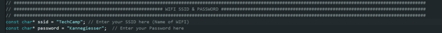
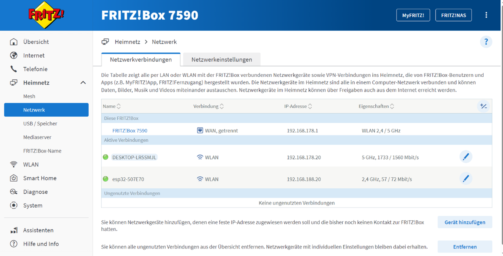
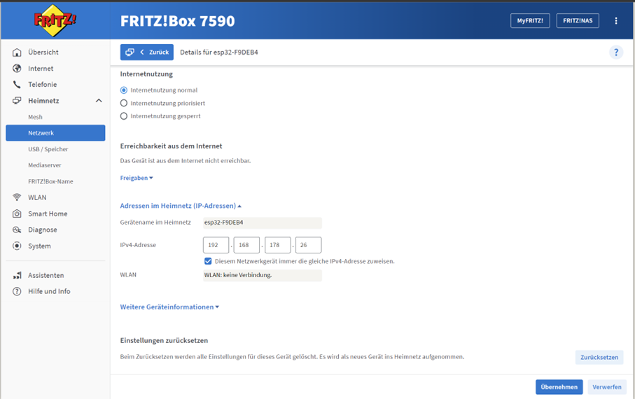

# Tech-Camp: Kannegiesser

Herzlich willkommen zum Tech-Camp bei Kannegiesser! Nachdem du in den ersten beiden Tagen in Zusammenarbeit mit der Ausbildungs- und Elektrowerkstatt deinen Trockner gebaut hast, werden wir uns auf eine Reise in die faszinierende Welt der Programmierung begeben und uns einem ganz besonderen Projekt widmen - der Programmierung deines Trockners. 

Gemeinsam werden wir den Prozess durchlaufen, von der Einrichtung der notwendigen Software und Treiber auf deinem Windows-System bis hin zur Implementierung des Codes, der unseren Trockner zum Leben erweckt. Du wirst lernen, wie man Visual Studio Code einrichtet, die notwendigen Plugins installiert und die Treiber konfiguriert, die für unser Projekt benötigt werden. 

Egal, ob du ein erfahrener Programmierer bist oder gerade erst anfängst, das Tech-Camp bietet eine großartige Gelegenheit, praktische Erfahrungen zu sammeln und deine Fähigkeiten zu erweitern. Wir freuen uns darauf, dich bei dieser spannenden Reise zu begleiten! 

# Anleitung zur Einrichtung von Visual Studio Code, Plugins und Treibern unter Windows
In dieser Anleitung werden wir Schritt für Schritt durch den Prozess der Einrichtung und Konfiguration von Visual Studio Code gehen, einschließlich der Installation der notwendigen Plugins und Treiber. Diese Anleitung ist sowohl für Anfänger als auch für erfahrene Benutzer gedacht und soll dazu beitragen, dass du schnell mit deiner Programmierarbeit beginnen kannst. Lass uns anfangen! 

### Bauteile

- Trockner
  - ESP32 WROOM 32 240MHz, 320KB RAM, 4MB Flash
  - Batteriefach mit 3x AA
  - H-Brücke
  - LED-Streifen

#### Zusätzlich wirst du zum Erstellen des Programms benötigen:

- USB-A Kabel mit USB-Micro-B (alte Ladekabel für z.B. Android-Handys)
- Laptop mit [Visual Studio Code](https://code.visualstudio.com/) mit [PlatformIO](https://platformio.org/)-Erweiterung

### Wichtiger Benutzerhinweis

**Stecke den ESP niemals mit dem USB-Kabel an Spannung an, wenn das Batteriefach auf AN steht!**

## Visual Studio Code

### Installation

1. Öffne deinen Webbrowser und besuche die offizielle Visual Studio Code-Website:  

    [https://code.visualstudio.com/](https://code.visualstudio.com/)

2. Klicke auf den Download-Button, um das Installationspaket für Windows herunterzuladen.

3. Nach dem Download öffne die Installationsdatei und folge den Anweisungen des Installationsassistenten, um Visual Studio Code auf deinem Gerät zu installieren.

### Starten

1. Nach der Installation von Visual Studio Code kannst du dieses über das Startmenü öffnen. 

2. Bei der ersten Verwendung wirst du aufgefordert, deine Einstellungen anzupassen. Du kannst die Standardeinstellungen beibehalten oder sie nach deinen Wünschen anpassen.
   
3. Um die Sprache anzupassen, öffnest du den Reiter “Extensions” und suchst nach “German Language Pack for Visual Studio Code” und installierst das Paket.

4. Nachdem du die Erweiterung erfolgreich installiert hast, starte das Programm neu, um alle
Änderung wirksam zu machen.

## PlatformIO Plugin

### Installation

1. Öffne Visual Studio Code.

2. Klicke auf das quadratische Symbol in der linken Seitenleiste, um den "Extensions"-Bereich zu öffnen.

3. Gib in das Suchfeld "PlatformIO" ein und suche nach dem entsprechenden Plugin.

4. Klicke auf "Installieren", um das PlatformIO-Plugin zu installieren.

5. Nachdem die Installation erfolgreich abgeschlossen wurde, starte Visual Studio Code neu.

6. Warte, bis alles automatisch konfiguriert worden ist.

## USB-Treiber NodeMCU CP2102 (ESP 32)

### Installation

1. Lade den USB-Treiber: CP2102 von der offiziellen Silicon Labs-Website für dein Betriebssystem herunter: [Silicon Labs Treiberseite](https://www.silabs.com/developers/usb-to-uart-bridge-vcp-drivers)

2. Suche die heruntergeladene Datei in deinem Verzeichnis, klicke diese mit einem Rechtsklick an und wähle „Alle extrahieren“ aus, um die Datei zu entpacken.

3. Navigiere in den entpackten Ordner und suche nach der „silabser.inf“ Datei.

4. Klicke nun mit der rechten Maustaste auf die „silabser.inf“ Datei und wähle „Installieren“ aus.

5. Folge nun dem Installationssetup, bis der Treiber erfolgreich installiert wurde.

### Installation Testen (Optional):

1. Öffne den Windows-Geräte-Manager, indem du in der Windows-Suche "Geräte-Manager" eingibst.

2. In der Kategorie „Anschlüsse (COM & LPT)" findest du nun den "Silicon Labs CP210x USB to UART Bridge". Solltest du diesen nicht sehen, ist bei der Treiberinstallation etwas schiefgelaufen, springe dann zum Abschnitt USB-Treiber installieren und führe die Schritte erneut aus.

## Repository

### Download

1. Öffne deinen Webbrowser und besuche das folgende Github-Repository:

    [https://github.com/KannegiesserTechCamp/Dryer](https://github.com/KannegiesserTechCamp/Dryer)

2. Wenn du einen anderen Branch auswählen willst, klicke auf „main“ und wähle diesen in dem Dropdown-Menü aus.

3. Zum Download drücke auf den grünen Button „Code“ und wähle „Download ZIP“ aus.

### Entpacken

1. Suche die heruntergeladene Datei in deinem Verzeichnis, klicke diese mit einem Rechtsklick an und wähle „Alle extrahieren“ aus, um die Datei zu entpacken.

## Funktionstest des ESP32 (Mikro Controller)

1. Starte Visual Studio Code und öffne das PlatformIO Plugin (Seitenleiste links).

2. Wähle unter Quick Access „Open“ aus, klicke auf „Open Project“ und wähle deinen Projektordner (z.B. “Dryer-main”) aus (standardmäßig ist das Projekt im Downloadordner zu finden).
   Diese Einrichtung kann einen Moment dauern.

3. Öffne nun wieder das PlatformIO Plugin und führe links im Reiter einen „Full Clean“ durch.

4. Optional für den Main Branch:

   Daraufhin wähle links im Reiter „PROJECT TASKS“ den Punkt „Build Filesystem Image“ aus.

   Nach dem erfolgreichen Beenden des Schrittes wähle links im Reiter „Upload Filesystem Image“ aus und warte bis im Terminal „SUCCESS“ steht.

   Nun wähle links im Reiter „Build“ aus und warte ebenfalls bis im Terminal „SUCCESS“ steht.

   Nun wähle links im Reiter „Upload and Monitor“ aus und warte ebenfalls bis im Terminal „SUCCESS“ steht.

## Ein tieferer Einblick in den Code

Unser Code besteht hauptsächlich aus einer "Main"-Datei. Diese Datei enthält immer ein Setup, in dem die Outputs/Inputs definiert werden, und eine Schleife (Loop), die ständig durchlaufen wird, solange Spannung anliegt. Im Setup können auch Methoden und Funktionen aufgerufen werden, die nicht ständig wiederholt werden müssen.

Die .h und .cpp Dateien spielen eine wichtige Rolle in unserer Code-Struktur. Wir haben die Funktionen und den Setup-Code des Trockners sowie der LED in separate .cpp Dateien ausgelagert, um die "Main"-Datei übersichtlicher zu gestalten. Die .h Datei ist eine Besonderheit in der C-Programmierung und stellt sicher, dass die "Main"-Datei weiß, welche Funktionen sie aus den .cpp Dateien verwenden darf.

In der "main.cpp" legen wir im Setup einen sogenannten Async-Webserver an. Dieser Webserver stellt unseren Server für die Website dar, die wir später aufrufen können. Er erhält zusätzlich Informationen zu unserem HTML-Code, CSS und unseren Bilddateien für die Website, sodass der Server diese Website "bauen" kann. Eine weitere Funktion des Webservers ist es, bei Erhalt eines bestimmten Pfades (ausgelöst durch die Buttons der Oberfläche) die entsprechende Funktion unseres Trockners bzw. unserer LED aufzurufen.

Der HTML-Code beschreibt die Elemente der Seite und stellt sicher, dass der richtige Pfad aufgerufen wird, wenn ein Button geklickt wird. Der CSS-Teil ist für das grafische Design der Website zuständig. Beide Dateien sind im "data"-Ordner ausgelagert und befinden sich auf der SD-Karte des ESPs. Dort werden auch alle Bilder gespeichert.

Die bereitgestellte Quelle enthält den Code für die "main.cpp"-Datei, einschließlich der Einbindung externer Bibliotheken, Definitionen von Konstanten und lokalen Variablen sowie dem Code zum Öffnen des Dateisystems.

## Router Verbindung einrichten

### WLAN-Konfiguration

Trage die richtige SSID (dies ist der Name deines Routers) und das Passwort des Routers in der “src/main.cpp” Datei ein. (Der Abschnitt befindet sich in Zeile 23 bis Zeile 27 in der Datei)



### FritzBox-Oberfläche (optional)

1. Öffne einen Webbrowser auf deinem Computer oder einem anderen Gerät, das mit dem gleichen Netzwerk wie deine FritzBox verbunden ist.
2. Gib die IP-Adresse deiner FritzBox in die Adressleiste des Browsers ein und drücke die Eingabetaste. Die Standard-IP-Adresse der FritzBox lautet normalerweise "192.168.178.1". Überprüfe die Dokumentation deiner FritzBox, wenn du dir nicht sicher bist. 
3. Gib das FritzBox-Passwort ein, um dich in die FritzBox-Oberfläche einzuloggen. Dieses Passwort findest du normalerweise auf einem Aufkleber auf deiner FritzBox oder in der Dokumentation. 
4. Navigiere in der FritzBox-Oberfläche zu den Heimnetz-Einstellungen und klicke auf den Punkt "Netzwerk". Der genaue Pfad kann je nach FritzBox-Modell variieren. Du solltest jedoch eine Option finden, die dir die Liste der aktuell verbundenen Geräte anzeigt. 
5. In der Liste der verbundenen Geräte suche nach dem Eintrag für deinen ESP32. Der Name oder die IP-Adresse des ESP32 sollte dort aufgeführt sein, wenn er erfolgreich mit der FritzBox verbunden ist.


6. Um eine feste IPv4 Adresse festzulegen, drücke bitte auf den Stift des entsprechenden ESPs und suche nach dem Punkt “Adressen im Heimnetz (IP-Adressen)” und wähle „Diesem Netzwerkgerät immer die gleiche IPv4-Adresse zuweisen.“ aus und setze hier bitte den Haken. Hierdurch bekommt das Gerät jedes Mal die gleiche IPv4 Adresse zugewiesen.


### Überprüfe die Serielle Ausgabe (optional)

Wenn du während der Programmierung des ESP32 die serielle Ausgabe für Debugging-Zwecke aktiviert hast, kannst du auch die serielle Ausgabe überprüfen, um den Verbindungsstatus zu überprüfen. Wenn der ESP32 erfolgreich eine Verbindung zu deinem WLAN herstellt, sollte dies in der seriellen Ausgabe angezeigt werden.

# Python Programmierung:
Die folgenden Beispiele können mit Hilfe des Online-Compilers von [Programiz](https://www.programiz.com/python-programming/online-compiler/) getestet werden.


## Digitaler Trockner

### Code

```Python
# in 'startup' wird die Startoption des Benutzers (0, 1 oder 2) gespeichert
# in 'prog' wird die Programmoption des Benutzers (0, 1 oder 2) gespeichert
# in 'progname' wird der Name vom gewählten, oder des neuen Programmes gespeichert
startup = 0
prog = 0
progname = ""

# Ausgabe der Optionen für den Benutzer
print("Tippe:\n\t\t (0) zum Beenden \n\t\t (1) zum starten \n\t\t (2) für neues Programm")

# Einlesen der Benutzereingabe
startup = int(input())

# Überprüfung der Benutzereingabe und Ausführung des entsprechenden Codes
if startup == 0:
    print("Du hast dich für das Beenden des Trockners entschieden")

elif startup == 1:
    print("Der Trockner wird hochgefahren")
    print("\t\t3\n\t\t2\n\t\t1\n\t\t0")
    print("Trockner gestartet")
    print("bereit zum Trocknen")

    print("Waehle eines der folgenden Programme zum Trocknen aus:")
    print("\t(1) \t schnelles Trocknen")
    print("\t(2) \t Schleudertrauma")
    print("\t(3) \t Presskuchen")

    scanf = int(input())
    print("Du hast dich für das folgenden Programm entschieden", end="")

    if prog == 1:
        # Zuweisung des Programmnamens an die Variable 'progname'
        progname = "schnelles Trocknen"
    elif prog == 2:
        progname = "Schleudertrauma"
    elif prog == 3:
        progname = "Presskuchen"

elif startup == 2:
    print("Du hast dich für das neue Programm entschieden")
    print("Gebe im Folgenden den Namen deines neuen Programms ein:")
    # Einlesen des neuen Programmnamens
    progname = input()

    print(f"Das Programm mit dem Namen: \n\t {progname} \nwurde erstellt")

else:
    print("Du hast leider keine der möglichen Eingaben (0), (1) gemacht")

print("Der Trockner wird heruntergefahren und beendet", end="")
```
Dieser Code stellt ein einfaches Menü zur Verfügung, mit dem der Benutzer verschiedene Optionen für einen digitalen Trockner auswählen kann. Der Benutzer kann den Trockner starten und ein Trockenprogramm auswählen, ein neues Programm erstellen oder den Trockner beenden. Die Auswahl des Benutzers wird über die Standard-Eingabe eingelesen und entsprechend verarbeitet. Der Code verwendet grundlegende Konzepte der Programmierung wie Variableninitialisierung, Ein- und Ausgabe, Kontrollstrukturen (if-else-Anweisungen) und Zeichenkettenoperationen.

Zum Testen: in den Online-Compilers von [Programiz](https://www.programiz.com/python-programming/online-compiler/) kopieren.

## Ausführliche Einführung

Dieses Programm stellt ein einfaches Menü zur Verfügung, mit dem der Benutzer verschiedene Optionen für einen digitalen Trockner auswählen kann. Es verwendet grundlegende Konzepte der Python-Programmierung wie Variableninitialisierung, Ein- und Ausgabe, Kontrollstrukturen (if-else-Anweisungen) und Zeichenkettenoperationen.

### Variableninitialisierung

In Python können Variablen direkt bei der ersten Zuweisung erstellt werden, ohne vorher einen Typ anzugeben. Zum Beispiel:
```python
startup = 0
prog = 0
progname = ""
```
In diesem Code werden zwei Ganzzahlvariablen (`startup` und `prog`) mit dem Startwert `0` 
und eine Zeichenkettenvariable (`progname`) mit einem leeren String `""` initialisiert.

### Ein- und Ausgabe

Die Funktionen `print` und `input` werden für die Ein- und Ausgabe verwendet. `print` wird 
verwendet, um Text auf dem Bildschirm auszugeben, und `input` wird verwendet, um die Eingabe 
des Benutzers zu lesen.

### Kontrollstrukturen

Die if-else-Anweisungen werden verwendet, um zu überprüfen, ob eine Bedingung erfüllt ist, 
und um den entsprechenden Codeblock auszuführen. Zum Beispiel:
```python
if startup == 0:
    print("Du hast dich für das Beenden des Trockners entschieden")
elif startup == 1:
    # Code für den Fall, dass 'startup' gleich 1 ist
else:
    # Code für den Fall, dass keine der vorherigen Bedingungen erfüllt ist
```

## Wäscheverwaltung
Zum Testen: in den Online-Compilers von [Programiz](https://www.programiz.com/python-programming/online-compiler/) kopieren.

### Code

```python
# Die Funktion 'waschen' nimmt einen String 'farbe' als Parameter an. Dieser String
# repräsentiert die Farbe der Wäsche, die gewaschen werden soll.
def waschen(farbe):
    # Die if-else-if-Anweisung überprüft, welche Farbe die Wäsche hat, und gibt eine
    # entsprechende Nachricht aus.
    if farbe == 'b':
        print("Blaue Waesche wird gewaschen")
    elif farbe == 'r':
        print("Rote Waesche wird gewaschen")
    elif farbe == 'g':
        print("Gruene Waesche wird gewaschen")
    elif farbe == 'w':
        print("Weisse Wasche wird gewaschen")
    elif farbe == 's':
        print("Schwarze Wasche wird gewaschen")
    else:
        # Wenn keine der obigen Bedingungen erfüllt ist (d.h., die Farbe ist nicht
        # blau, rot, grün, weiß oder schwarz), wird angenommen, dass die Wäsche bunt ist.
        print("\t\t Diese Farbe ist unbekannt")
        print("\t\t Die bunte Waesche wird gewaschen")


# Deklaration der Variablen
# 'exit' ist eine boolesche Variable, die bestimmt, ob die Hauptschleife des Programms weiterlaufen soll.
# 'anzahl' ist eine Ganzzahlvariable, die die Anzahl der Wäschestapel speichert.
# 'fertig' ist eine Ganzzahlvariable, die verwendet wird, um zu überprüfen, ob der Benutzer weitere Stapel hinzufügen möchte.
# 'farbe' ist eine Zeichenkettenvariable (str), die die Farbe der Wäsche speichert.
exit = True
anzahl = 0
fertig = 0
farbe = ""

# Ausgabe der Einführungsnachricht
print("Dies ist eine Aufnahmestelle fuer die Verwaltung von Waesche")

# Hauptschleife des Programms. Sie läuft so lange, bis der Benutzer entscheidet,
# dass keine weiteren Stapel hinzugefügt werden sollen.
while exit:
    # Aufforderung zur Eingabe der Anzahl und Farbe der Wäschestapel
    print("Gebe im folgenden Format: Anzahl(int) Farbe(char) an, was fuer Waesche angeliefert wurde")
    eingabe = input().split()
    anzahl = int(eingabe[0])
    farbe = eingabe[1]

    # Schleife zum Waschen jedes Wäschestapels
    for i in range(anzahl):
        print(f"Stapel-Nr. {i + 1}  ", end="")
        waschen(farbe)

    # Aufforderung zur Eingabe, ob weitere Stapel verteilt werden sollen
    print("Sollen weitere Stapel verteilt werden? Nein (0), Ja (1)")
    fertig = int(input())
    if fertig == 0:
        exit = False

# Ausgabe der Abschlussnachricht
print("Wir haben es geschafft, alle Stapel konnten sortiert werden", end="")
```

Dieser Code stellt ein einfaches Menü zur Verfügung, mit dem der Benutzer die Anzahl und Farbe von Wäschestapeln eingeben kann, die gewaschen werden sollen. Der Benutzer kann dann angeben, ob weitere Stapel verteilt werden sollen oder nicht. Der Code verwendet grundlegende Konzepte der Programmierung wie Variablendeklaration, Ein- und Ausgabe, Kontrollstrukturen (if-else-Anweisungen und Schleifen) und Funktionen.

## Ausführliche Einführung

### Variableninitialisierung

In Python werden Variablen direkt mit einem Startwert initialisiert. Der Datentyp wird 
dabei automatisch aus dem zugewiesenen Wert abgeleitet. Zum Beispiel:
```python
exit = true
anzahl = 0
fertig = 0
farbe = ""
```

In diesem Code werden eine boolesche Variable (`exit`), zwei Ganzzahlvariablen (`anzahl` und `fertig`) mit dem Startwert `0` 
und eine Zeichenkettenvariable (`farbe`) mit einem ``leeren String `""` initialisiert.

### Ein- und Ausgabe

Die Funktionen `print` und `input` werden für die Ein- und Ausgabe verwendet. `print` wird 
verwendet, um Text auf dem Bildschirm auszugeben, und `input` wird verwendet, um die Eingabe 
des Benutzers zu lesen.

### Kontrollstrukturen

Die if-else-Anweisungen werden verwendet, um zu überprüfen, ob eine Bedingung erfüllt ist, 
und um den entsprechenden Codeblock auszuführen. Zum Beispiel:
```python
if farbe == 'b':
    print("Blaue Waesche wird gewaschen")
elif farbe == 'r':
    print("Rote Waesche wird gewaschen")
elif farbe == 'g':
    print("Gruene Waesche wird gewaschen")
else:
    print("\t\t Diese Farbe ist unbekannt")
    print("\t\t Die bunte Waesche wird gewaschen")
```

### Funktionen

Eine Funktion ist ein Block von Code, der eine bestimmte Aufgabe ausführt. In diesem Programm 
gibt es eine Funktion: `waschen`. Die `waschen`-Funktion dient dazu, die Wäsche basierend auf 
ihrer Farbe zu waschen. In Python werden Funktionen mit dem Schlüsselwort `def` definiert.
